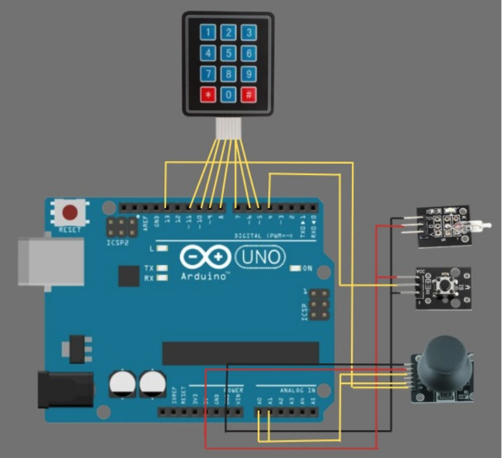
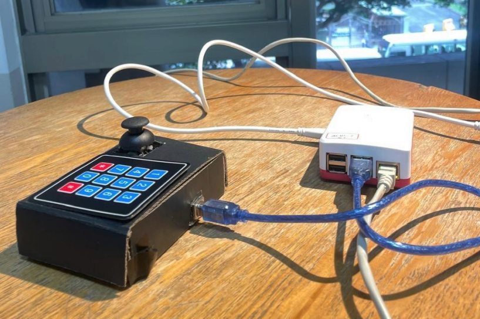

# Overview 
The objective of this project was to develop an engaging racing simulation that utilizes a custom physical input interface and is deployable via a standard web browser. This approach demands a robust and low-latency solution for real-time data
transfer across multiple platforms.
The game utilizes the established physics and rendering
of the Unity Racing Starter Kit. The core innovation lies
in the architecture of the system, which maps the physical
driving actions–steering, accelerating, and braking–to bespoke
electronic components. Unlike traditional wired systems, this
project employs a server-client architecture using a Raspberry Pi and Web-socket communication to deliver the controls to a Unity WebGL instance running in a browser.

# Built with
- C#
- Arduino 
- Raspyberry Pi
- HTML

# Controller 
### Wiring Diagram
This layer captures user input and converts it into a digital
format.
- Hardware Controller (Player Input): Comprises the
Joystick, Tilt Switch, and Keypad. These components
were sourced from the standard sensor kit configuration.

- Arduino UNO: The Arduino UNO acts as the primary
micro-controller, interfacing directly with the physical
components. It reads the analog and digital sensor data,
aggregates it, and transmits them serially.

  

### Set Up
- Here can be seen the final setup, once the controller is connected to the Raspeberry Pi.
  

# System Flow
- Data Ingestion: The Raspberry Pi receives the serial input from the Arduino UNO. Efficient serial communication is critical to bridge the micro-controller and the
single-board computer.
- Node-RED: This visual programming environment is deployed on the Raspberry Pi to rapidly implement serverside logic [1]. Node-RED is used to parse the serial datastream, manage the communication flow, and prepare the
data for web transmission.
- Web-socket Communication: The processed control
data are published by Node-RED via a Web-socket
server. This protocol ensures a persistent, bi-directional,
and low-latency connection, critical for real-time gaming
control.

# Demo
https://github.com/user-attachments/assets/791d872f-cd1c-4965-8388-b6cbab9d80db
# Contributors
- [Alejandro Adorno](https://github.com/vawms): Designed and programmed the hardware controller.
- [Nicolas Vega](https://github.com/NicoVegaPortaluppi): Designed and programmed the connection between the controller, the Raspberry Pi and the game. Hosted the game on the Raspberry Pi.
